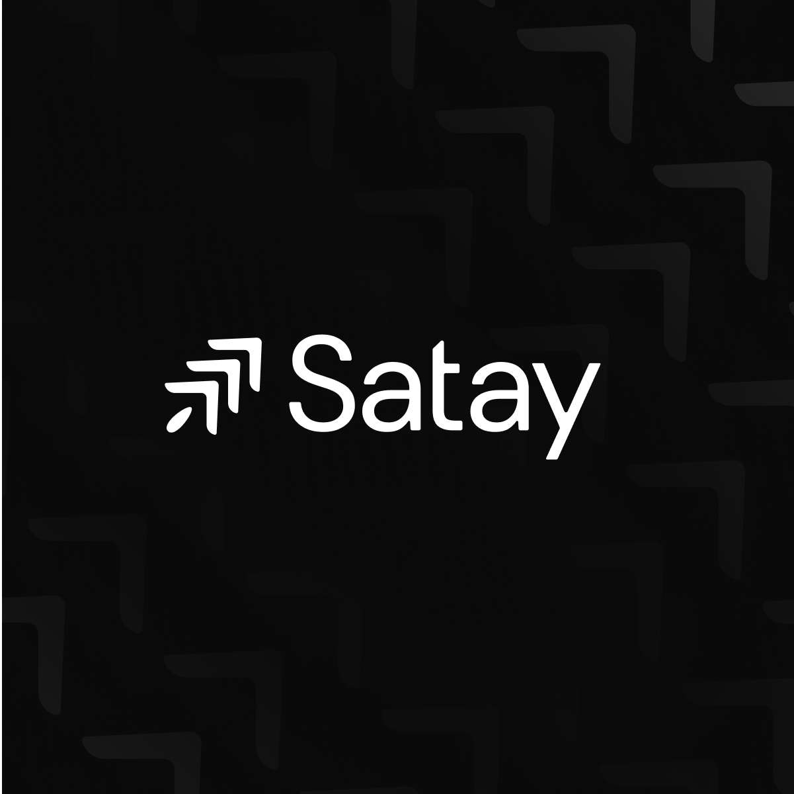

# **Hey, I’m Bennett 👋**

I am a Computer Science and Applied Mathematics student at [**Vanderbilt**](https://www.vanderbilt.edu/) building with emergent technologies.

# Current Projects

I am currently working on two projects in blockchain witha past project in AI.

## [**Movement Labs** ](https://movementlabs.xyz): ***A Move-based Layer 2 Blockchain***

**Key Components of the Move Rollup Framework**
- Executor: Processes transactions and generates new L2 blocks.
- Bridge Contracts: Facilitates asset deposits and withdrawals between L1 and the rollup.
- Sequencer: Orders transactions.
- Data Availability Service: Ensures transaction data accessibility to the settlement mechanism.
- Settlement Mechanism: Verifies transaction execution correctness through various methods (e.g., zk-proofs, optimistic rollups, staked rollups).

**Achievements**

- Member of the core engineering team from the company's inception through its \$3.4M pre-seed raise and \$38M Series A funding, contributing to technical development and growth.

- Succesful launch of [incentivized public testnet](https://testnet.movementlabs.xyz/)

## [**Satay Finance** ](https://app.satay.finance/): ***All-in-one DeFi aggregator for Movement***

**Three Pillars of Satay Finance**
1. [***Blocks***](https://app.satay.finance/blocks) - composable DeFi primitive operations through trusted third-party protocols
2. [***Strategies***](https://app.satay.finance/products) - compositions of Blocks that facilitate multi-protocol yield generation
3. [***Vaults***](https://app.satay.finance/vaults) - secure capital pools that optimize allocations to Blocks and Strategies to maximize yield

## [Special Education ChatBot ](https://github.com/bennettdavisv1/special-ed-chat-bot): ***AI-powered virtual special education teacher***

## Technologies Used

- Python Programming Language
- OpenAI ChatGPT4
- HTML/CSS/JS
- Flask

